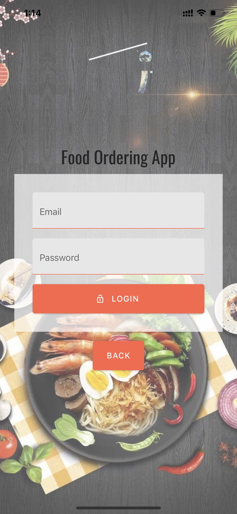
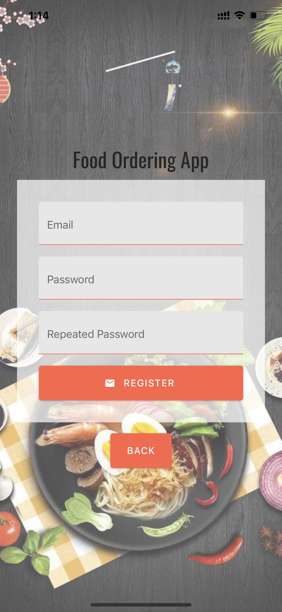
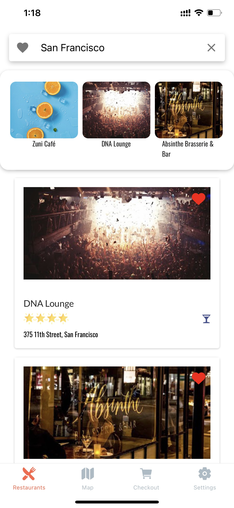
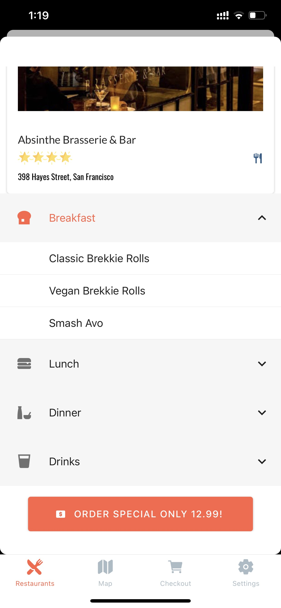
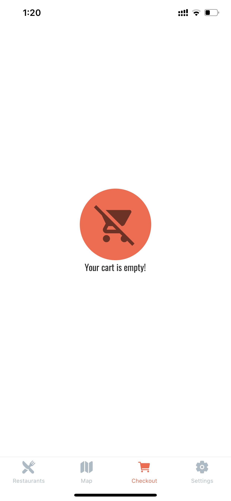
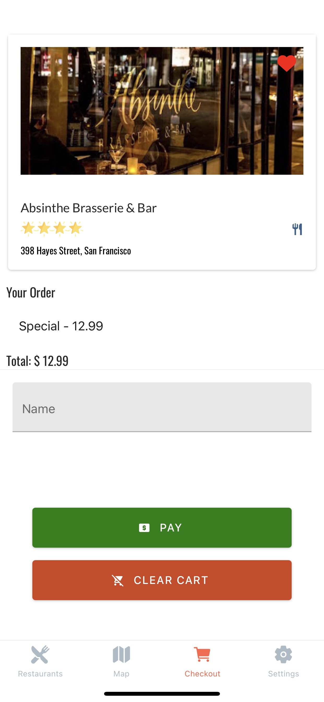
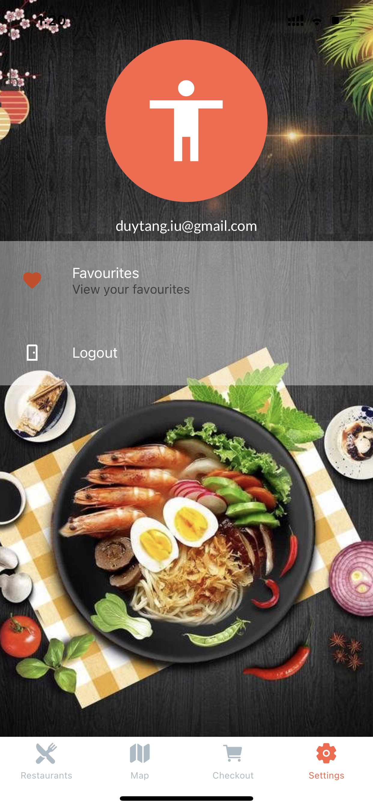
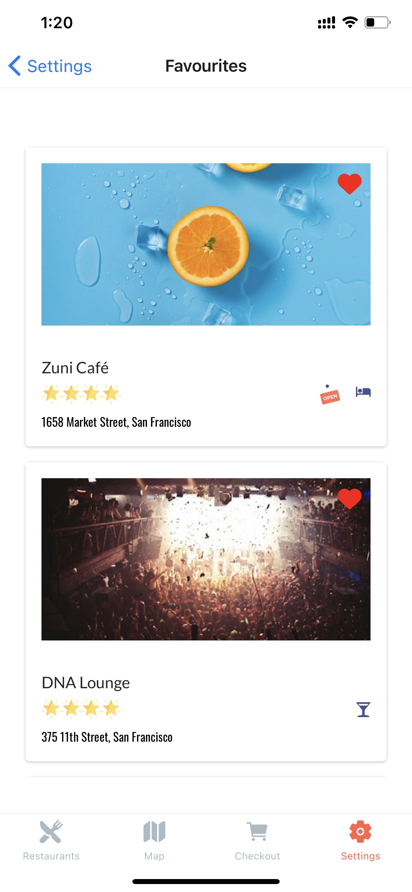

# Food Ordering App

My name is Tăng Thanh Duy. I just graduated IT degree from The University of Western Australia. I finished React JS course on Udemy and focused on React Native which I have passionated about. This project is just a demo that allow me to use knowledge learning from Udemy courses to apply to this demo project. 

## Demo App

### Account page

### Login page

### Register page

### Restaurants page

### Detail Restaurant page

### Map page

### Empty Cart page

### Cart page

### Settings page

### Favourites page

